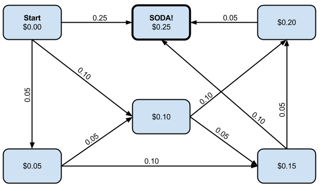

# State Machines

## Objective

Become familiar with the notation of state machines and be able to describe the
simple function of any machine with a state machine.

## Description of State Machines

The study of deterministic methods of reasoning, beginning with deterministic
finite automata.

A finite state machine is the most common construct in all of Computer Science.
It is the basis on which the rest of computation is built.

* [Finite-state machine](https://en.wikipedia.org/wiki/Finite-state_machine)
* [Automata Theory](https://en.wikipedia.org/wiki/Automata_theory)

A _state machine_ is a collection of _states_ and _transitions_ between those
states. Each transition is a description of what triggers the transition into
the new state.

Here is an example transition from `Happy` state to `Sad` state and back:

Sometimes it is useful to think of the transitions as events. Other times it is
useful to think of them as "input consumed".

All computable problems can eventually be decomposed into state machines, but
programming languages offer features for us to conveniently not need to code
everything up as a state machine.

State machines often have a special _start state_ (denoting where to start) and
one or more _terminal states_ (when to end).

The Greek letter ε (epsilon) is used to denote an state transition for which no
event is required (or no input consumed) for the transition to take place.

## Example Usage

State machines are frequently used explicitly in a number of programming situations.

* Network protocols
* Terminal emulators
* Web login systems
* Compilers
* Game AI

Anyplace _state_ needs to be maintained, a state machine is of use.

## Exercises

### Draw a state machine diagram for an old-fashioned soda machine

The soda machine takes any combination of nickels, dimes, or quarters to reach
$0.25, then dispenses a soda.

(Error states omitted for brevity, e.g. what happens if the user puts in a dime
and then a quarter?)

Notice how the addition of each coin moves us to the next state (which is the
total value deposited so far). Or put another way, how the consumption of the
next input moves us to the next state.

Follow the state machine as the user deposits a dime, a nickel, and then another
dime.

### Draw a state machine diagram for a video game AI

Video game AIs can exist in a lot of states, e.g. idling, bored, running, shooting.

1. Come up with a list of 4 states an AI can be in.
2. Figure out the transitions between those states.
3. Draw a state machine diagram of your AI.
