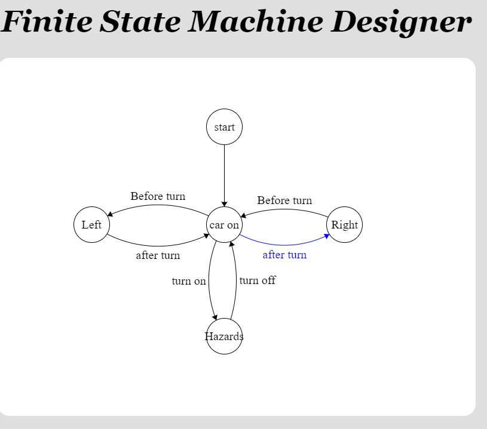

<?xml version="1.0" standalone="no"?>
<!DOCTYPE svg PUBLIC "-//W3C//DTD SVG 1.1//EN" "http://www.w3.org/Graphics/SVG/1.1/DTD/svg11.dtd">

<svg width="800" height="600" version="1.1" xmlns="http://www.w3.org/2000/svg">
	<ellipse stroke="black" stroke-width="1" fill="none" cx="157.5" cy="279.5" rx="30" ry="30"/>
	<text x="140.5" y="285.5" font-family="Times New Roman" font-size="20">Left</text>
	<ellipse stroke="black" stroke-width="1" fill="none" cx="580.5" cy="279.5" rx="30" ry="30"/>
	<text x="558.5" y="285.5" font-family="Times New Roman" font-size="20">Right</text>
	<ellipse stroke="black" stroke-width="1" fill="none" cx="379.5" cy="466.5" rx="30" ry="30"/>
	<text x="346.5" y="472.5" font-family="Times New Roman" font-size="20">Hazards</text>
	<ellipse stroke="black" stroke-width="1" fill="none" cx="379.5" cy="279.5" rx="30" ry="30"/>
	<text x="354.5" y="285.5" font-family="Times New Roman" font-size="20">car on</text>
	<ellipse stroke="black" stroke-width="1" fill="none" cx="379.5" cy="115.5" rx="30" ry="30"/>
	<text x="362.5" y="121.5" font-family="Times New Roman" font-size="20">start</text>
	<path stroke="black" stroke-width="1" fill="none" d="M 353.957,295.174 A 188.406,188.406 0 0 1 183.043,295.174"/>
	<polygon fill="black" stroke-width="1" points="353.957,295.174 344.56,294.347 349.096,303.259"/>
	<text x="231.5" y="336.5" font-family="Times New Roman" font-size="20">after turn</text>
	<path stroke="black" stroke-width="1" fill="none" d="M 183.701,264.945 A 202.154,202.154 0 0 1 353.299,264.945"/>
	<polygon fill="black" stroke-width="1" points="183.701,264.945 193.061,266.128 188.866,257.05"/>
	<text x="222.5" y="237.5" font-family="Times New Roman" font-size="20">Before turn</text>
	<path stroke="black" stroke-width="1" fill="none" d="M 555.288,295.682 A 163.412,163.412 0 0 1 404.712,295.682"/>
	<polygon fill="black" stroke-width="1" points="555.288,295.682 545.884,294.93 550.492,303.805"/>
	<text x="443.5" y="335.5" font-family="Times New Roman" font-size="20">after turn</text>
	<path stroke="black" stroke-width="1" fill="none" d="M 406.69,266.885 A 207.03,207.03 0 0 1 553.31,266.885"/>
	<polygon fill="black" stroke-width="1" points="406.69,266.885 415.942,268.728 412.401,259.376"/>
	<text x="434.5" y="244.5" font-family="Times New Roman" font-size="20">Before turn</text>
	<path stroke="black" stroke-width="1" fill="none" d="M 366.115,439.69 A 179.932,179.932 0 0 1 366.115,306.31"/>
	<polygon fill="black" stroke-width="1" points="366.115,439.69 367.793,430.407 358.506,434.113"/>
	<text x="291.5" y="379.5" font-family="Times New Roman" font-size="20">turn on</text>
	<path stroke="black" stroke-width="1" fill="none" d="M 389.946,307.6 A 228.505,228.505 0 0 1 389.946,438.4"/>
	<polygon fill="black" stroke-width="1" points="389.946,307.6 387.445,316.696 397.026,313.834"/>
	<text x="404.5" y="378.5" font-family="Times New Roman" font-size="20">turn off</text>
	<polygon stroke="black" stroke-width="1" points="379.5,145.5 379.5,249.5"/>
	<polygon fill="black" stroke-width="1" points="379.5,249.5 384.5,241.5 374.5,241.5"/>
</svg>

