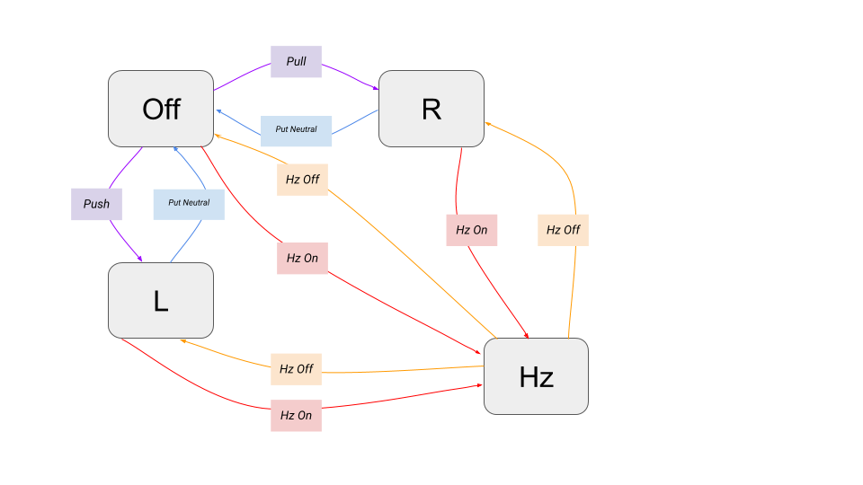

## State Machine Problem

> Draw out the state machine for a car's turn signal system. What are the
   transitions leading to both lights not blinking, one light blinking, the
   other light blinking, or both lights blinking?

### Identify States

1. `Off`: *Both* blinkers off.
2. `L`:   Left blinker on (*right blinker off*).
3. `R`:   Right blinker on (*left blinker off*).
4. `Hz`:  *Both* blinkers on (*hazard lights on*).

### Identify Transitions

(*Please note that notation used might be wildly wrong.*)

* Input **Push**: Push down turn signal lever 
  Transition: `Off` ⟶ `L`
* Input **Pull**: Pull up turn signal lever 
  Transition: `Off` ⟶ `R`
* Input **Put Neutral**: Put turn signal lever in neutral/resting position 
  Transition: *s* ∈ {`L`, `R`} ⟶ `Off`
* Input **Hz On**: Toggle hazard light indicator on. 
  Transition: *s* ∈ {`Off`, `L`, `R`} ⟶ `Hz` 
* Input **Hz Off**: Toggle hazard light indicator off. 
  Transition: `Hz` ⟶ *s* ∈ {`Off`, `L`, `R`}  

### Draw It Out

